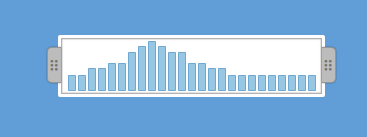

# Peripleo Timerange Selector

The timerange selection widget from Peripleo. [See it in action](https://pelagios.github.io/timerange-selector/).



## Usage

HTML
```html
<html>
  <head></head>
  <body>
    <div id="my-selector"></div>
  </body>
</html>
```

JavaScript
```javascript
// Histogram data: an array of key/values, where the key is the year (integer) the
// bin starts, and the value is the count in the bin
var data = [
  { "-200" : 1  },
  { "-150" : 1  },
  { "-100" : 2  },
  {  "-50" : 2  },
  {    "0" : 3  },
  {   "50" : 3  },
  {  "100" : 6  },
  {  "150" : 8  },
  {  "200" : 10 },
  {  "250" : 8  },
  {  "300" : 6  },
  {  "350" : 6  },
  {  "400" : 3  },
  {  "450" : 3  },
  {  "500" : 2  },
  {  "550" : 2  },
  {  "600" : 1  },
  {  "650" : 1  },
  {  "700" : 1  },
  {  "750" : 1  },
  {  "800" : 1  },
  {  "850" : 1  },
  {  "900" : 1  },
  {  "950" : 1  },
  { "1000" : 1  }
];

var t = new Pelagios.TimerangeSelector(document.getElementById('my-selector')));
t.update(data);
t.on('changed', function(evt) {
  // Logs the selection interval (in years) to the JS console
  console.log(evt);
});
```

## TODO

At the moment: too much to list. Some major burning issues I can think of now are:

- Find a good way to organize the codebase and build minified JS (and CSS). Perhaps using
  [Gulp](https://gulpjs.com/)? (In Peripleo, namespacing and module loading was handled
  via Require.js. Alternatives?)
- Should we remove jQuery dependency? The only major issue will be to re-implement touch-compatible
  drag behavior... remaining jQuery use should be easy to eliminate if desired
- Fix various quirks in the UI (overlapping handle labels etc.)
- Proper instantiation with a config object to control appearance, bar style etc.
- Support dates, not just integer years
- Implement properly working resampling in case the number of bins in the input data is larger
  than what can be displayed
- ...
